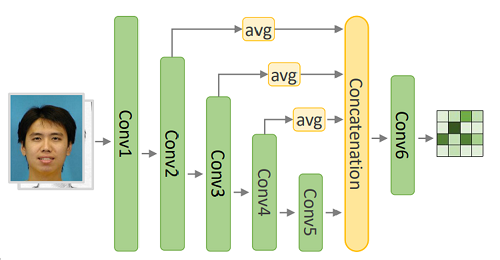

# chan

## Coarse-to-Fine Image-to-Image Translation via Attentively Collaborative

we provide PyTorch implementations for our paper "Complementary, Heterogeneous and Adversarial
Networks for Image-to-Image Translation"

### Our Proposed Framework
#### Generator

#### Discriminator

### Sample Result

### Prerequisites
- Linux or similar environment
- Python 2.7
- NVIDIA GPU + CUDA CuDNN

### Getting Started

#### installation
- clone this repo:
```shell script
git clone https://github.com/fei-hdu/chan.git
cd chan
```
- install PyTorch 0.4+
#### Quick Start(Apply a Pre-trained Model)
- Download a dataset
    - [CUFS](http://mmlab.ie.cuhk.edu.hk/archive/facesketch.html) split train and test with this [files](https://drive.google.com/open?id=1TYQ5O9q4ZMiuBimPMqqj7O_SyHoijwmn)
    - **CityScapes,Facades.Google Map,Edge2Shoes,Edge2Handbags**: you can download by [Pix2Pix bash](https://github.com/phillipi/pix2pix/blob/master/datasets/download_dataset.sh) 
    - Paris Street View : you can contact [Deepak Pathak](https://github.com/pathak22) to get the dataset 
- we use fine-tuning to train our model eg.CUFS
    - first you need train on Pix2Pix to get a coarse model or you can Download a pre-trained model(pre-trained with [Pix2Pix](https://github.com/jehovahxu/pix2pix-pytorch)) in  [here](https://drive.google.com/open?id=1dfe2pqAUD4T6fD9vO38SM2HCYJSe9Nxj)
    - Train a model:
        - you can download a pre-trained pix2pix model in
        ```shell script
        python train.py --dataroot {dataset path} --datalist {datalist path} --pre_netG {coarse model path} --gpuid {your gpu ids}  
        ```
- Test
    ```shell script
    python test.py --dataroot {dataset path} --datalist {datalist path} --pre_netG {final model path} --gpuid {your gpu ids}
    ```
#### Apply a pre-trained model
A face photo-to-sketch model pre-trained on the CUSF: [Google Drive](https://drive.google.com/open?id=173H7FdwG7UOMM1G-4sm7zKUBu0yFypul)

The pre-trained model need to be save at `./checkpoint`

Then you can test the model

### Result
Our final result can be downloaded in [here](https://drive.google.com/open?id=1AzmHkcGa21h6Mngdc7sEIH1hOR6GrBTS)

Our Quantitative performance in a variety of image-to-image translation tasks. The total score gained by every model  on each dataset are reported in the column of score


### Training/Test Tips
Best practice for training and testing your models.<p>
Feel free to ask any questions about coding.Xingxin Xu, [jehovahxu@gmail.com](jehovahxu@gmail.com)<p>

### Citation
If you find this useful for your research, please cite our paper as:
```
@article{gao2020ca-gan,
	title = {Complementary, Heterogeneous and Adversarial Networks for Image-to-Image Translation},
	author = {},
	year = {2020},
	url = {https://github.com/fei-hdu},
}
```

### Acknowledgments
Our code is inspired by [pytorch-CycleGAN-and-pix2pix](https://github.com/junyanz/pytorch-CycleGAN-and-pix2pix)

<!--
### Citation
If you use this code for your research, plase cite our papers.
-->


